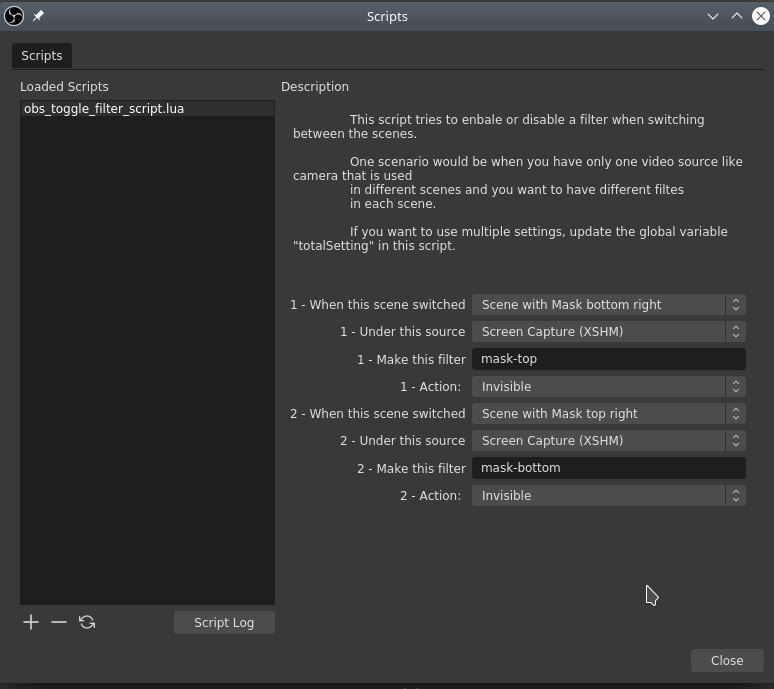

# Toggle filter when selecting scenes script for OBS-Studio
 
This is a Lua script useful as a script in [OBS studio](https://obsproject.com/) that would let you enable or disable a filter when switching a scene

## Example

Assume you have configured two scenes that they share one common resource like a video source.

_For some resources you have to re-use a source like a webcam or capture card source._

For each scene you would like to have two different "Image/Mask blend" filters.

With this script you can set after selecting a specific scene which filter should be activated or deactivated.

 
For this example I edited the script and changed the variable **"totalSetting"** to 2.
 
 ### Result
 